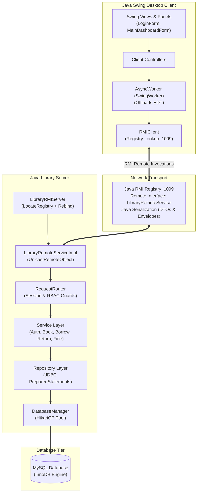

# Remote School Library Management

[-orange.svg)](https://www.oracle.com/java/)
[](https://ant.apache.org/)
[-00758F.svg)](https://www.mysql.com/)
[](https://junit.org/junit4/)
[](https://docs.oracle.com/javase/8/docs/technotes/guides/swing/)
[](https://docs.oracle.com/javase/8/docs/technotes/guides/rmi/)

A 3-tier client-server school library management system designed for university Computer Networking and Network Programming coursework. The system enables book and student management, circulation workflows (borrowing and returns), hold reservations, fine settlements, catalog search with prefix autocomplete, and audit logging over **Java Remote Method Invocation (Java RMI)** and **Java Object Serialization**. Server-side atomic locking guarantees that two concurrent clients cannot borrow the same book copy simultaneously.

---

## Table of Contents

- [Features](#features)
  - [Authentication & Account Management](#authentication--account-management)
  - [Library Management](#library-management)
  - [Search & Autocomplete](#search--autocomplete)
  - [Role-Based Access Control](#role-based-access-control)
- [Architecture](#architecture)
- [Tech Stack](#tech-stack)
- [Project Structure](#project-structure)
- [User Roles & Permissions](#user-roles--permissions)
- [Student Account Registration](#student-account-registration)
- [Security](#security)
  - [Password Security](#password-security)
  - [Rate Limiting & Global Account Lockout](#rate-limiting--global-account-lockout)
  - [Session Security & Immediate Revocation](#session-security--immediate-revocation)
  - [Authorization Guard Pipeline](#authorization-guard-pipeline)
  - [Audit Logging](#audit-logging)
- [Database Design](#database-design)
- [Networking & Protocol](#networking--protocol)
- [Build & Installation](#build--installation)
  - [Prerequisites](#prerequisites)
  - [Database Setup](#database-setup)
  - [Build Commands](#build-commands)
- [Running the Application](#running-the-application)
  - [1. Start the Server](#1-start-the-server)
  - [2. Start the Client](#2-start-the-client)
- [Testing](#testing)
- [Release & Distribution](#release--distribution)
- [Configuration](#configuration)
- [Known Limitations](#known-limitations)
- [Future Improvements](#future-improvements)
- [License](#license)

---

## Features

### Authentication & Account Management
* **Credentials Verification**: Secure authentication using PBKDF2 with SHA-256 and cryptographic salts.
* **Rate Limiting & Lockout**: 5 consecutive failed attempts trigger an automatic 15-minute global account lockout.
* **Multi-Session Revocation**: Entering lockout immediately revokes all active sessions across all connected clients for that user.
* **Session Lifecycle**: Server-managed session tokens with a 30-minute idle expiration policy.
* **Password Management**: In-app password changes requiring verification of current credentials.
* **Security Audit Logging**: Key authentication and administrative actions are logged with timestamps and actor IDs.

### Library Management
* **Book & Catalog Administration**: CRUD operations for books, category mapping, multi-author associations, ISBN uniqueness, and copy tracking (`total_copies`, `available_copies`).
* **Circulation Desk**:
  * **Borrow Transaction**: Multi-step transaction validating student status, book availability, and borrow limits before atomically updating inventory.
  * **Return Transaction**: Check-in workflow verifying loan records, restoring copy counts, and automatically calculating overdue fines when applicable.
* **Hold Reservations**: Students can reserve checked-out books; administrators and librarians review, fulfill, or cancel reservations.
* **Fine Settlement**: Automated fine calculation based on overdue days and recording of fine payments with collector audit tracking.
* **Student Registry**: Manage student profiles, study classes, contact details, account states (`ACTIVE`, `SUSPENDED`, `GRADUATED`), and borrowing quotas.

### Search & Autocomplete
* **Multi-Field Catalog Search**: Case-insensitive filtering across title, author, category, or ISBN.
* **Live Autocomplete Suggestions**: Dynamic 300ms debounced type-ahead suggestions for books, authors, and student records, populated asynchronously without UI blocking.

### Role-Based Access Control
* **Three Defined Roles**: `ADMIN`, `LIBRARIAN`, and `STUDENT`.
* **Server-Authoritative Enforcement**: Client-side UI visibility is strictly for user experience; all permissions are enforced authoritatively on the server.

---

## Architecture

The system is strictly organized into a 3-tier distributed architecture over **Java Remote Method Invocation (Java RMI)**:



### Module Boundaries

* **`common` (`thuvien.common`)**: Remote interface (`LibraryRemoteService`), shared protocol envelopes (`Request`, `Response`), Action enumeration, StatusCode constants, Data Transfer Objects (DTOs), domain enums, and exceptions. Has **zero** dependencies on Swing or JDBC.
* **`server` (`thuvien.server`)**: RMI Server bootstrap (`LibraryRMIServer`), Remote implementation (`LibraryRemoteServiceImpl`), `RequestRouter`, business services, JDBC repositories, `SessionManager`, `PasswordHasher`, and HikariCP connection pool. Has **zero** Swing dependencies.
* **`client` (`thuvien.client`)**: Swing GUI views, panels, dialogs, client controllers, `ClientSession`, and `RMIClient`. Has **zero** JDBC, SQL (`java.sql.*`), or database driver dependencies.

---

## Tech Stack

| Layer / Component | Technology | Version / Specification |
|---|---|---|
| **Runtime & Language** | Java (OpenJDK / Amazon Corretto) | Java 8 (Source & Target `1.8`) |
| **Desktop Client GUI** | Java Swing | Standard JDK 8 |
| **Network Transport** | Java RMI (Remote Method Invocation) | `java.rmi.*`, RMI Registry Port 1099 |
| **Serialization** | Java Object Serialization | `java.io.Serializable` |
| **Database Engine** | MySQL (InnoDB) | 5.7+ / 8.0+ |
| **Connection Pooling** | HikariCP | 4.0.3 |
| **Build System** | Apache Ant via NetBeans | 1.9+ (`build.xml`) |
| **IDE Compatibility** | Apache NetBeans | 8.x / 12.x+ |
| **Testing Framework** | JUnit 4 | 4.13.2 |
| **Logging Bridge** | SLF4J & `java.util.logging` | 1.7.36 |

---

## Project Structure

```text
thuvien/
├── common/                             # Shared protocol, DTOs, and enums
│   └── src/thuvien/common/
│       ├── dto/                        # Transfer objects (BookDTO, StudentDTO, etc.)
│       ├── enums/                      # Role, status, and domain enumerations
│       ├── exception/                  # Domain exceptions (AuthenticationException, etc.)
│       └── protocol/                   # Request, Response, Action, StatusCode
├── server/                             # Server-side implementation
│   ├── src/thuvien/server/
│   │   ├── database/                   # HikariCP DatabaseManager lifecycle
│   │   ├── network/                    # LibraryServer and ClientHandler
│   │   ├── repository/                 # JDBC repositories with PreparedStatements
│   │   │   └── impl/
│   │   ├── router/                     # RequestRouter (guards and dispatching)
│   │   ├── security/                   # PasswordHasher and SessionManager
│   │   ├── service/                    # Business logic and atomic transactions
│   │   │   └── impl/
│   │   └── ServerMain.java             # Server application entry point
│   └── resources/
│       ├── db.properties               # Database connection settings
│       └── server.properties           # TCP port and thread pool settings
├── client/                             # Swing Desktop client implementation
│   ├── src/thuvien/client/
│   │   ├── controller/                 # UI controllers assembling requests
│   │   ├── network/                    # TCPNetworkClient maintaining connection
│   │   ├── session/                    # ClientSession tracking active user
│   │   ├── view/                       # Swing forms, panels, and dialogs
│   │   │   ├── common/                 # AsyncWorker, SearchAutoCompleteHelper
│   │   │   ├── dialogs/                # Book, student, and loan modal dialogs
│   │   │   ├── panels/                 # Dashboard, books, circulation panels
│   │   │   ├── LoginForm.java          # Login and activation view
│   │   │   └── MainDashboardForm.java  # Main application frame
│   │   └── ClientMain.java             # Client application entry point
│   └── resources/
│       └── client.properties           # Client connection settings
├── database/                           # Database definition and seed files
│   ├── schema.sql                      # DDL for 10 InnoDB tables
│   ├── indexes.sql                     # Performance and composite indexes
│   └── seed.sql                        # Initial seed data for testing
├── lib/                                # Compile and runtime dependencies
├── nbproject/                          # NetBeans Ant project configuration
├── build.xml                           # Apache Ant modular build script
├── manifest.mf                         # JAR manifest configuration
└── README.md                           # Project documentation
```

---

## User Roles & Permissions

| Action / Capability | ADMIN | LIBRARIAN | STUDENT | Server Enforcement Mechanism |
|---|:---:|:---:|:---:|---|
| **Login / Logout** | Yes | Yes | Yes | `RequestRouter` (`SessionManager`) |
| **Register Account (Activation)** | No | No | Public | Validates unused activation code |
| **Change Own Password** | Yes | Yes | Yes | Validates current password & session |
| **View Dashboard Metrics** | Yes | Yes | No | `requireRole(ADMIN, LIBRARIAN)` |
| **Personal Student Dashboard** | No | No | Yes | `requireRole(STUDENT)` (Own data only) |
| **Search & Browse Catalog** | Yes | Yes | Yes | Authenticated session required |
| **Search Autocomplete Suggestions**| Yes | Yes | Yes | Student restricted to catalog & own loans |
| **Create / Update / Delete Book** | Yes | Yes | No | `requireRole(ADMIN, LIBRARIAN)` |
| **Manage Categories & Authors** | Yes | Yes | No | `requireRole(ADMIN, LIBRARIAN)` |
| **View Student Directory** | Yes | Yes | No | `requireRole(ADMIN, LIBRARIAN)` |
| **Create / Update Student Record** | Yes | Yes | No | `requireRole(ADMIN, LIBRARIAN)` |
| **Delete Student Record** | Yes | No | No | `requireRole(ADMIN)` |
| **Generate Activation Code** | Yes | No | No | `requireRole(ADMIN)` |
| **View Personal Student Profile** | Yes* | Yes* | Yes | Student restricted to own profile (IDOR guard) |
| **Issue Loan (Borrow Book)** | Yes | Yes | No | `requireRole(ADMIN, LIBRARIAN)` |
| **Process Book Return** | Yes | Yes | No | `requireRole(ADMIN, LIBRARIAN)` |
| **View All Borrow Records** | Yes | Yes | No | `requireRole(ADMIN, LIBRARIAN)` |
| **View Own Active Loans** | No | No | Yes | Filtered by session `userId` |
| **Create Hold Reservation** | Yes | Yes | Yes | Student restricted to own `studentId` |
| **Cancel Hold Reservation** | Yes | Yes | Yes | Student can only cancel own reservations |
| **View All Holds / Reservations** | Yes | Yes | No | `requireRole(ADMIN, LIBRARIAN)` |
| **Calculate Overdue Fine** | Yes | Yes | No | `requireRole(ADMIN, LIBRARIAN)` |
| **Settle / Pay Fine** | Yes | Yes | No | `requireRole(ADMIN, LIBRARIAN)` |
| **View Own Fines** | No | No | Yes | Filtered by session `userId` |
| **Inspect System Audit Logs** | Yes | No | No | `requireRole(ADMIN)` |

*\*Staff can query any student profile by student ID.*

---

## Student Account Registration

The system provides a two-step self-service account onboarding workflow:

```text
+-----------------------+
|     Administrator     |
+-----------+-----------+
            |
            | Generates Activation Code (GENERATE_STUDENT_ACTIVATION)
            v
+-----------------------+
|  student_activations  | Stores SHA-256 hash of activation code
+-----------+-----------+
            |
            | Code provided to student
            v
+-----------------------+
|  Student Registration | Submits student_code, activation_code, and password
+-----------+-----------+
            |
            | Verified in atomic transaction:
            | 1. Matches SHA-256 hash of code
            | 2. Checks is_used == FALSE
            | 3. Creates user record (Role: STUDENT)
            | 4. Links students.user_id = users.id
            | 5. Sets is_used = TRUE
            v
+-----------------------+
|   Account Activated   | Student logs in immediately
+-----------------------+
```

---

## Security

### Password Security
* **PBKDF2 Hashing**: Passwords are saved using `PBKDF2WithHmacSHA256` with:
  * Iteration count: `10,000`
  * Salt: 16 cryptographically secure random bytes via `SecureRandom`
  * Derived key length: 256 bits
  * Storage format: `PBKDF2$<iterations>$<saltHex>$<hashHex>`
  * Comparison: Constant-time validation using `MessageDigest.isEqual`
* **Automatic Hash Upgrade**: Legacy un-salted SHA-256 hashes from initial seed records are automatically upgraded to salted PBKDF2 upon the user's first successful login.

### Rate Limiting & Global Account Lockout
* **Lockout Threshold**: 5 consecutive failed login attempts on an account trigger an immediate 15-minute global account lockout.
* **Server-Wide Invalidation**: Lockout is evaluated at the server before every protected action. While locked:
  * Subsequent login attempts are blocked, even if the correct password is submitted.
  * Requests return `401 UNAUTHORIZED` with a localized message indicating remaining minutes.
* **Automatic Expiration**: When the 15-minute lockout period elapses, the lock clears automatically without requiring manual administrator intervention.
* **Failed Counter Reset**: A successful login resets the failed attempts counter to 0.

### Session Security & Immediate Revocation
* **Server-Managed Tokens**: Clients authenticate via random UUID session tokens tracked in memory using `ConcurrentHashMap`.
* **Immediate Revocation on Lockout**: Triggering an account lockout instantly removes all active sessions for that user across all client devices (`SessionManager.revokeAllSessionsForUser`).
* **Idle Timeout**: Sessions expire automatically after 30 minutes of inactivity.
* **Logout**: Calling `LOGOUT` explicitly removes the session token from memory.

### Authorization Guard Pipeline

Every socket request arriving at `RequestRouter` traverses a strict sequential guard pipeline:

```text
Incoming Socket Request
         |
         v
+-----------------------------------+
| 1. Session Token Validation       |  Missing or expired token -> 401 UNAUTHORIZED
+-----------------+-----------------+
                  | Valid
                  v
+-----------------------------------+
| 2. Global Account Status Check    |  Account locked -> Revoke session & return 401
+-----------------+-----------------+
                  | Active
                  v
+-----------------------------------+
| 3. Role-Based Authorization (RBAC)|  Insufficient role -> 403 FORBIDDEN
+-----------------+-----------------+
                  | Authorized
                  v
+-----------------------------------+
| 4. Ownership & IDOR Protection    |  Unauthorized record target -> 403 FORBIDDEN
+-----------------+-----------------+
                  | Verified
                  v
+-----------------------------------+
| 5. Service & Atomic Transaction   |  Business rule validation & DB execution
+-----------------------------------+
```

### Audit Logging
Administrative and security events are logged to the `audit_logs` table:
* Event Types: `LOGIN_SUCCESS`, `LOGIN_FAILED`, `ACCOUNT_LOCKED`, `LOGIN_BLOCKED_LOCKED`, `LOGOUT`, `PASSWORD_CHANGED`, `ACTIVATION_CODE_GENERATED`, `BORROW_CREATED`, `RETURN_COMPLETED`, `RESERVATION_CREATED`, `RESERVATION_CANCELLED`, `FINE_PAID`.
* **Confidentiality Guarantee**: Plaintext passwords, password hashes, session tokens, and raw activation codes are never recorded in audit logs.

---

## Database Design

The database uses the MySQL **InnoDB** storage engine to support foreign key constraints and ACID-compliant transactions.

```text
+-------------------+       +--------------------+       +----------------------+
|       users       | 1---1 |      students      | 1---* |  student_activations |
+-------------------+       +--------------------+       +----------------------+
                                      | 1
                                      |
                     +----------------+----------------+
                     | *                               | *
           +--------------------+            +--------------------+
           |   borrow_records   |            |    reservations    |
           +--------------------+            +--------------------+
             | 1            | *                | *            | 1
             |              |                  |              |
             |       +--------------+          |       +--------------+
             |       |    fines     |          |       |    books     |
             |       +--------------+          |       +--------------+
             |                                 |              | *
             +---------------------------------+              |
                                                              | 1
                                                     +------------------+
                                                     | book_authors (N) |
                                                     +------------------+
                                                              | *
                                                              | 1
                                                     +------------------+
                                                     |     authors      |
                                                     +------------------+
```

### Key Tables Overview

| Table | Description | Key Constraints |
|---|---|---|
| `users` | Accounts, hashed credentials, roles | `UNIQUE(username)`, `is_active` |
| `students` | Student registry, borrow limits, loan counts | `UNIQUE(student_code)`, FK to `users` |
| `books` | Catalog items, copy counts, shelf locations | `UNIQUE(isbn)`, `CHECK(available_copies >= 0)` |
| `categories` | Genre and academic subject classifications | `UNIQUE(name)` |
| `authors` | Author biographies and nationalities | `PRIMARY KEY(id)` |
| `book_authors` | Many-to-many relationship mapping | Composite PK `(book_id, author_id)` |
| `borrow_records` | Circulation transactions | FK to `students`, `books`, `users` |
| `reservations` | Hold queues for checked-out books | FK to `students`, `books` |
| `fines` | Overdue penalty assessments and payments | FK to `borrow_records`, `students` |
| `student_activations`| One-time account activation tokens | Hash stored, `is_used` boolean flag |
| `audit_logs` | System security and operational audit trail | Indexed by timestamp and entity |

---

## Networking & Protocol

Communication between client and server takes place over **Java Remote Method Invocation (Java RMI)** using standard Java Object Serialization envelopes and DTOs.

### RMI Remote Interface & Service

* **Remote Interface**: `thuvien.common.rmi.LibraryRemoteService` extending `java.rmi.Remote`.
* **Remote Object Implementation**: `thuvien.server.rmi.LibraryRemoteServiceImpl` extending `java.rmi.server.UnicastRemoteObject`.
* **RMI Registry Port**: Default `1099` (configured in `server.properties` and `client.properties`).
* **Service Name**: `"LibraryRemoteService"`.
* **Client Adapter**: `thuvien.client.network.RMIClient` performs `LocateRegistry.getRegistry(host, 1099).lookup("LibraryRemoteService")` and translates UI controller actions into remote invocations.

### Protocol Envelopes & DTOs

* **`Request`**:
  * `requestId`: UUID string for request-response correlation.
  * `action`: Action enum identifier (e.g. `LOGIN`, `BORROW_BOOK`).
  * `token`: Active session token (auto-injected by `RMIClient`).
  * `payload`: Action-specific DTO or parameter object.
* **`Response`**:
  * `requestId`: Echoed UUID correlating with the originating request.
  * `statusCode`: Status code (`200 OK`, `201 CREATED`, `400 BAD_REQUEST`, `401 UNAUTHORIZED`, `403 FORBIDDEN`, `404 NOT_FOUND`, `409 CONFLICT`, `500 SERVER_ERROR`).
  * `message`: User-readable message or error description.
  * `data`: Return DTO, collection, or operation result.

### Concurrency & Thread Safety
* **RMI Concurrency**: The RMI runtime dynamically allocates thread workers to handle concurrent client calls simultaneously without blocking unaffected operations.
* **Strict Anti-Race Borrowing**: Server-side atomic transaction decrement (`available_copies = available_copies - 1 ... WHERE id = ? AND available_copies > 0`) prevents two concurrent clients from borrowing the same single available copy.
* **Swing EDT Protection**: All remote invocations in the desktop client execute asynchronously via `AsyncWorker` (`SwingWorker`), preventing UI freezing.

---

## Build & Installation

### Prerequisites
* **Java Development Kit (JDK)**: Java 8 (OpenJDK 1.8 / Amazon Corretto 8).
* **Build Tool**: Apache Ant 1.9+ (or NetBeans IDE 8.x / 12.x+).
* **Database**: MySQL 5.7+ or 8.0+ running on `127.0.0.1:3306`.

### Database Setup

1. Connect to your local MySQL instance:
   ```bash
   mysql -u root -p
   ```
2. Execute the initialization scripts in the `database/` directory:
   ```sql
   SOURCE database/schema.sql;
   SOURCE database/indexes.sql;
   SOURCE database/seed.sql;
   ```

*Note: Verify that `server/resources/db.properties` reflects your local MySQL username and password.*

### Build Commands

Using Apache Ant from the project root:

```bash
# Clean previous build artifacts
ant clean

# Compile all modules (common, server, client)
ant compile

# Run full automated test suite (99 tests)
ant test

# Clean, compile, test, and package release JAR
ant clean compile test jar
```

---

## Running the Application

### 1. Package Server & Client Distributions

```bash
ant package-all
```

### 2. Start the Server

The server must be started on the host machine (where MySQL is running) before launching client instances.

```bash
# Option A: Using portable batch script in Server distribution
dist\server-dist\run-server.bat

# Option B: Using Ant target
ant run-server

# Option C: Directly from packaged JAR
java -jar dist/server-dist/server.jar
```

Expected startup console output:
```text
[INFO] Active LAN IPv4 Addresses:
       - 10.15.38.111 (Wi-Fi)
[INFO] RMI Registry running on port 1099
[INFO] Service 'LibraryRemoteService' bound successfully.
[INFO] Library RMI Server is ONLINE and awaiting client connections.
```

### 3. Start the Client

You can launch the client on the same machine (`127.0.0.1`) or copy `dist/client-dist/` to another laptop on the same Wi-Fi/LAN:

```bash
# Option A: Using portable batch script (uses resources/client.properties or LoginForm input)
dist\client-dist\run-client.bat

# Option B: Passing Server IP and Port directly via CLI arguments
dist\client-dist\run-client.bat 10.15.38.111 1099

# Option C: Using Ant target
ant run-client
```

In `LoginForm`, you can also enter **Server IP** (e.g., `10.15.38.111`), **Port** (`1099`), and click **"Kiểm tra kết nối"** to verify `PING -> PONG` connectivity over Java RMI prior to logging in.

---

## Testing

The project contains 9 automated JUnit 4 test suites. The entire test suite executes via:

```bash
ant clean compile test
```

### Test Suite Verification Results

```text
The current test suite contains 99 tests with 0 failures, 0 errors, and 0 skipped tests.
```

| Test Suite | Class Name | Tests | Failures | Errors | Skipped | Status |
|---|---|:---:|:---:|:---:|:---:|:---:|
| **Protocol Serialization** | `thuvien.common.ProtocolTest` | 2 | 0 | 0 | 0 | **PASS** |
| **RequestRouter & RBAC** | `thuvien.server.RequestRouterTest` | 24 | 0 | 0 | 0 | **PASS** |
| **Database Persistence Smoke** | `thuvien.server.database.MySQLSmokeIntegrationTest` | 4 | 0 | 0 | 0 | **PASS** |
| **Java RMI End-to-End & Concurrency** | `thuvien.server.rmi.RMIEndToEndIntegrationTest` | 15 | 0 | 0 | 0 | **PASS** |
| **TCP Legacy Networking** | `thuvien.server.network.TCPEndToEndIntegrationTest` | 11 | 0 | 0 | 0 | **PASS** |
| **Architecture & Dependency Guard**| `thuvien.server.repository.RepositoryArchitectureTest`| 3 | 0 | 0 | 0 | **PASS** |
| **Authentication Service** | `thuvien.server.service.AuthServiceTest` | 5 | 0 | 0 | 0 | **PASS** |
| **Borrow Concurrency & Isolation** | `thuvien.server.service.BorrowConcurrencyIntegrationTest`| 3 | 0 | 0 | 0 | **PASS** |
| **Fine Calculation & Settlement** | `thuvien.server.service.FineServiceTest` | 3 | 0 | 0 | 0 | **PASS** |
| **Security & Lockout Hardening** | `thuvien.server.service.SecurityAndFeatureHardeningTest` | 29 | 0 | 0 | 0 | **PASS** |
| **TOTAL** | **10 Suites** | **99** | **0** | **0** | **0** | **100% PASS** |

---

## Release & Distribution

Running `ant package-all` produces isolated Server and Client distributions in `dist/`:

```text
dist/
├── server-dist/                      # Standalone Server distribution (Deploy on Server host)
│   ├── server.jar                    # ServerMain + server & common classes (no client GUI)
│   ├── run-server.bat                # Portable Windows launcher script
│   ├── resources/
│   │   ├── server.properties         # TCP port (9999), thread pool, timeout
│   │   ├── db.properties             # Server-only MySQL JDBC & HikariCP configuration
│   │   └── db.properties.example     # Template database configuration
│   └── lib/
│       ├── HikariCP-4.0.3.jar
│       ├── mysql-connector-java-8.0.33.jar
│       ├── slf4j-api-1.7.36.jar
│       └── slf4j-jdk14-1.7.36.jar
│
├── client-dist/                      # Standalone Client distribution (Deploy on Client laptops)
│   ├── client.jar                    # ClientMain + Swing UI & common DTOs (ZERO DB/Server classes)
│   ├── run-client.bat                # Portable Windows launcher (supports: run-client.bat [IP] [Port])
│   ├── resources/
│   │   └── client.properties         # Default server.host=127.0.0.1, server.port=9999
│   └── lib/                          # Empty (Client uses pure JDK + Swing + TCP sockets)
│
└── thuvien.jar                       # Combined NetBeans default artifact
```

---

## Configuration

Configuration files are located in `resources/` directories and externalized in each distribution:

### Database Configuration (`server/resources/db.properties` — Server Only)
```properties
db.url=jdbc:mysql://127.0.0.1:3306/school_library?useSSL=false&serverTimezone=UTC&characterEncoding=UTF-8&allowPublicKeyRetrieval=true
db.username=root
db.password=
db.pool.maxSize=10
db.pool.minIdle=2
```

### Server Networking (`server/resources/server.properties`)
```properties
server.port=9999
server.threadPoolSize=20
server.socketTimeout=30000
```

### Client Networking (`client/resources/client.properties`)
```properties
server.host=127.0.0.1
server.port=9999
network.timeout=10000
```

---

## Known Limitations

* **Transport Layer Security**: Communication takes place over raw, unencrypted TCP sockets (`java.net.Socket`). Traffic is not encrypted with TLS/SSL; the application is intended for private school networks or coursework demonstration.
* **In-Memory Session Store**: Active session tokens and temporary lockout counters are stored in server memory (`ConcurrentHashMap`). Restarting the server process clears active sessions, requiring connected clients to log in again.
* **Single Server Architecture**: The server operates as a standalone process without distributed session synchronization or clustering support.
* **Desktop Platform**: The client interface requires Java Swing and a desktop graphical environment.

---

## Future Improvements

* **TLS Socket Transport**: Implementation of `SSLSocket` and `SSLServerSocket` using custom keystores and truststores.
* **Externalized Configuration**: Support for environment variable overrides (`DB_URL`, `DB_PASSWORD`, `SERVER_PORT`) without modifying property files.
* **Database Session Storage**: Persisting sessions and lockout states in the database or Redis cache to maintain continuity across server restarts.
* **Catalog Pagination**: Implementing offset/limit pagination in Swing table views for catalogs containing thousands of entries.

---

## License

License: Not specified.
