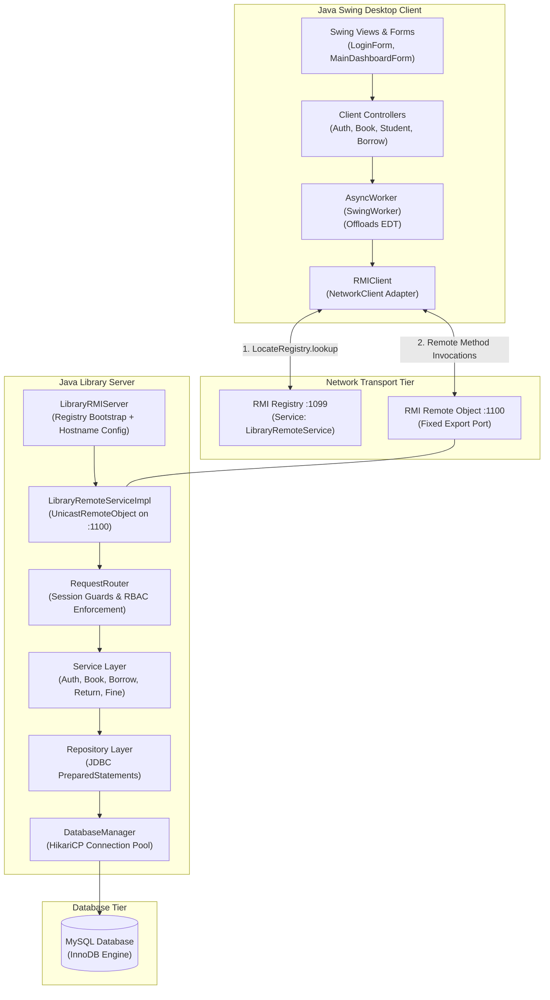

# Remote School Library Management System

A distributed 3-tier client-server school library management system designed for university Computer Networking and Network Programming coursework. The system enables comprehensive library circulation (catalog administration, book borrowing and returns, hold reservations, fine settlements, prefix search autocomplete, and security audit logging) over **Java Remote Method Invocation (Java RMI)** and **Java Object Serialization**.

A core technical highlight is the **server-authoritative concurrency guarantee**: when multiple clients simultaneously attempt to borrow the last available copy of a book, server-side atomic transactions and row-level database locking ensure that exactly one request succeeds, competing requests receive an informative error, and copy inventory never drops below zero.

---

## Table of Contents

- [Features](#features)
- [Architecture](#architecture)
- [Technologies](#technologies)
- [Project Structure](#project-structure)
- [Environment & Requirements](#environment--requirements)
- [Database Setup](#database-setup)
- [Configuration](#configuration)
- [Building the Project](#building-the-project)
  - [Using Apache Ant Bundled with NetBeans](#using-apache-ant-bundled-with-netbeans)
  - [Using NetBeans IDE](#using-netbeans-ide)
- [Testing](#testing)
- [Running the Server](#running-the-server)
  - [Server in Development Mode](#server-in-development-mode)
  - [Server in Packaged Mode](#server-in-packaged-mode)
- [Running the Client](#running-the-client)
  - [Client in Development Mode](#client-in-development-mode)
  - [Client in Packaged Mode](#client-in-packaged-mode)
- [Running on Two Computers over LAN / Wi-Fi](#running-on-two-computers-over-lan--wi-fi)
  - [1. Server Machine Setup](#1-server-machine-setup)
  - [2. Client Machine Setup](#2-client-machine-setup)
- [RMI Connection Diagnostics](#rmi-connection-diagnostics)
- [Demo Accounts](#demo-accounts)
- [Packaging & Distribution](#packaging--distribution)
- [Troubleshooting](#troubleshooting)
- [Security & Coursework Notes](#security--coursework-notes)

---

## Features

### Authentication & Account Security
* **Cryptographic Password Hashing**: Passwords stored using PBKDF2 with HMAC-SHA256 and cryptographically secure random salting, with backward-compatible SHA-256 verification.
* **Brute-Force Rate Limiting**: 5 consecutive failed login attempts trigger an automated 15-minute global account lockout.
* **Immediate Multi-Session Invalidation**: Lockout immediately revokes all active sessions across all connected clients for the affected user.
* **Session Management**: Server-side in-memory session token store with a 30-minute idle expiration policy.
* **Self-Service Password Change**: In-app password updates requiring validation of the current password and confirmation.

### Role-Based Access Control (RBAC)
* **Three Defined Roles**: `ADMIN`, `LIBRARIAN`, and `STUDENT`.
* **Server-Authoritative Enforcement**: Client GUI visibility is purely convenience; all actions are strictly verified by `RequestRouter` on the server before execution.

### Library & Catalog Management
* **Catalog Administration**: CRUD operations for books, category classifications, and multi-author associations.
* **Inventory Tracking**: Dedicated copy tracking per book (`total_copies`, `available_copies`, `shelf_location`, `status`).
* **Multi-Field Catalog Search**: Case-insensitive filtering across title, author, category, or ISBN.
* **Prefix Search Autocomplete**: Asynchronous debounced suggestions for books, authors, and student records without UI blocking.

### Circulation Desk (Borrow & Return)
* **Atomic Borrowing Workflow**: Multi-step transaction validating student status, active loan quotas, and book availability.
* **Strict Anti-Race Concurrency**: Atomic conditional decrement (`available_copies = available_copies - 1 ... WHERE id = ? AND available_copies > 0`) prevents double-borrowing of the last copy by concurrent clients.
* **Return & Fine Assessment**: Check-in workflow restores available copies, updates loan records to `RETURNED`, and automatically assesses fines for overdue loans based on configurable daily penalty rates.
* **Hold Reservations**: Students can reserve checked-out books; staff can review, fulfill, or cancel hold queues.
* **Fine Settlement**: Cash collection recording with collector attribution and balance clearance.

### Student Registry & Self-Service Activation
* **Student Records**: Profile maintenance (student code, class, contact details, status, borrow limits).
* **Self-Service Registration**: Prospective students activate their user accounts using pre-generated one-time activation codes (`ACT-STU...`).

### Operational Audit Logging
* Comprehensive event logging (`LOGIN_SUCCESS`, `LOGIN_FAILED`, `ACCOUNT_LOCKED`, `PASSWORD_CHANGED`, `BORROW_CREATED`, `RETURN_COMPLETED`, `FINE_PAID`, etc.).
* Sensitive secrets (plaintext passwords, hashes, session tokens) are never recorded in audit logs.

---

## Architecture

The system is strictly partitioned into a 3-tier distributed architecture over **Java Remote Method Invocation (Java RMI)**:



### Strict Architectural Boundaries:
1. **Client ↔ Server Transport**: Communication takes place exclusively via Java RMI and Java Serialization (`Serializable` DTOs and envelopes).
2. **Server-Only Database Access**: Only the Server connects to MySQL via HikariCP. The Client distribution contains **zero** JDBC drivers, zero database connection strings, and zero server repository classes.
3. **Legacy Networking Code**: Older raw TCP classes (`thuvien.server.network.LibraryServer`, `thuvien.client.network.TCPNetworkClient`, `thuvien.server.network.ClientHandler`) remain in the codebase strictly as historical coursework reference material. They are **not** used by the active desktop client or server runtime.

---

## Technologies

| Component / Layer | Technology | Specification / Version |
|---|---|---|
| **Language & Runtime** | Java SE | Java 8 (OpenJDK 1.8 / Amazon Corretto 8) |
| **Desktop Client GUI** | Java Swing | Standard JDK 8 (`javax.swing.*`, `java.awt.*`) |
| **Remote Communication** | Java RMI | `java.rmi.*`, `UnicastRemoteObject` |
| **RMI Registry Port** | TCP 1099 | `LocateRegistry.createRegistry(1099)` |
| **RMI Remote Object Port** | TCP 1100 | Fixed export port (avoids random firewall-blocked ports) |
| **Object Transfer** | Java Serialization | `java.io.Serializable` with explicit `serialVersionUID` |
| **Database Engine** | MySQL (InnoDB) | 5.7+ / 8.0+ (Tested on Laragon MySQL 8.0.30) |
| **Connection Pooling** | HikariCP | 4.0.3 |
| **JDBC Driver** | MySQL Connector/J | 8.0.33 |
| **Build System** | Apache Ant via NetBeans | NetBeans 8.0.2 bundled Ant 1.9.x |
| **Testing Framework** | JUnit 4 | 4.13.2 |
| **Logging** | SLF4J & `java.util.logging` | 1.7.36 |

---

## Project Structure

```text
thuvien/
├── common/                             # Shared RMI interface, DTOs, and domain enums
│   └── src/thuvien/common/
│       ├── dto/                        # Transfer objects (BookDTO, StudentDTO, UserSessionDTO, etc.)
│       ├── enums/                      # UserRole, BookStatus, BorrowStatus, StudentStatus
│       ├── exception/                  # Domain exceptions (AuthenticationException, BookUnavailableException)
│       ├── protocol/                   # Request, Response, Action, StatusCode envelopes
│       └── rmi/                        # LibraryRemoteService (Remote Interface)
├── server/                             # Server-side business, database, and RMI implementation
│   ├── src/thuvien/server/
│   │   ├── database/                   # HikariCP DatabaseManager lifecycle
│   │   ├── repository/                 # JDBC repositories with SQL PreparedStatements
│   │   ├── rmi/                        # LibraryRMIServer (bootstrap) & LibraryRemoteServiceImpl
│   │   ├── router/                     # RequestRouter (session validation & RBAC dispatch)
│   │   ├── security/                   # PasswordHasher and SessionManager
│   │   └── service/                    # Business logic and atomic database transactions
│   └── resources/
│       ├── db.properties               # MySQL database connection and HikariCP pool configuration
│       ├── db.properties.example       # Template database configuration
│       └── server.properties           # RMI registry port (1099), service port (1100), service name
├── client/                             # Swing Desktop client implementation
│   ├── src/thuvien/client/
│   │   ├── controller/                 # UI controllers translating views to RMI calls
│   │   ├── network/                    # RMIClient (adapter implementing NetworkClient)
│   │   ├── session/                    # ClientSession tracking logged-in user and token
│   │   ├── view/                       # Swing forms, panels, and modal dialogs
│   │   └── ClientMain.java             # Client application bootstrap
│   └── resources/
│       └── client.properties           # Default RMI host (127.0.0.1) and registry port (1099)
├── database/                           # Database definition and seed scripts
│   ├── schema.sql                      # DDL for 11 InnoDB tables with foreign key constraints
│   ├── indexes.sql                     # B-Tree performance indexes
│   └── seed.sql                        # Initial seed data (demo accounts, sample catalog, students)
├── scripts/                            # Diagnostic helper scripts
│   └── test-rmi-ports.ps1              # PowerShell port connectivity test for ports 1099 and 1100
├── test/                               # Automated JUnit 4 test suites (10 test suites, 99 tests)
│   └── thuvien/
│       ├── common/                     # ProtocolTest (envelope & serialization)
│       └── server/
│           ├── database/               # MySQLSmokeIntegrationTest
│           ├── network/                # TCPEndToEndIntegrationTest
│           ├── repository/             # RepositoryArchitectureTest
│           ├── rmi/                    # RMIEndToEndIntegrationTest
│           ├── service/                # AuthServiceTest, FineServiceTest, BorrowConcurrencyIntegrationTest, etc.
│           └── RequestRouterTest.java  # RequestRouter authorization & routing tests
├── lib/                                # Compile and runtime dependencies
│   ├── HikariCP-4.0.3.jar
│   ├── mysql-connector-java-8.0.33.jar
│   ├── slf4j-api-1.7.36.jar
│   ├── slf4j-jdk14-1.7.36.jar
│   ├── junit-4.13.2.jar
│   └── hamcrest-core-1.3.jar
├── dist/                               # Distribution packages (generated by package-all)
│   ├── server-dist/                    # Standalone Server distribution (server.jar + lib + resources)
│   └── client-dist/                    # Standalone Client distribution (client.jar + resources + diagnostic script)
├── test-connection.bat                 # Root helper script to verify ports 1099 & 1100
├── nbproject/                          # NetBeans 8.0.2 project metadata
└── build.xml                           # Apache Ant build script
```

---

## Environment & Requirements

* **Operating System**: Windows 10 / 11 (64-bit).
* **Java Development Kit**: JDK 8 (OpenJDK 1.8 or Amazon Corretto 8). Ensure `JAVA_HOME` points to your JDK 8 installation and `java -version` reports `1.8.0_xxx`.
* **Integrated Development Environment (IDE)**: Apache NetBeans 8.0.2 (or compatible NetBeans 8.x / 12.x+).
* **Build System**: Apache Ant bundled inside NetBeans. **No separate Apache Ant installation or PATH configuration is required.**
* **Database**: MySQL 5.7+ or 8.0+ running on `127.0.0.1:3306` (Laragon 6.0 recommended).

---

## Database Setup

1. Start your local MySQL instance (e.g., launch Laragon and click **Start All**).
2. Verify MySQL is listening on port `3306`.
3. Open a MySQL terminal or GUI client (HeidiSQL, MySQL Workbench, or Command Prompt):
   ```sql
   CREATE DATABASE IF NOT EXISTS school_library CHARACTER SET utf8mb4 COLLATE utf8mb4_unicode_ci;
   USE school_library;
   SOURCE database/schema.sql;
   SOURCE database/indexes.sql;
   SOURCE database/seed.sql;
   ```
4. Verify server database configuration in `server/resources/db.properties`:
   ```properties
   db.driver=com.mysql.cj.jdbc.Driver
   db.url=jdbc:mysql://localhost:3306/school_library?useSSL=false&allowPublicKeyRetrieval=true&serverTimezone=UTC&characterEncoding=UTF-8
   db.username=root
   db.password=
   ```

> [!NOTE]
> `db.password=` is left blank by default purely for local development environments (such as Laragon's default MySQL root account). For production or staging environments, always set a strong password and copy `server/resources/db.properties.example` to `server/resources/db.properties`.

---

## Configuration

### Server Configuration (`server/resources/server.properties`)
```properties
# Java RMI Server Configuration
rmi.registry.port=1099
rmi.service.port=1100
rmi.service.name=LibraryRemoteService

# Optional: manually override published LAN IP if multi-homed
# rmi.server.host=192.168.1.100
```

### Client Configuration (`client/resources/client.properties`)
```properties
# Java RMI Client Configuration
rmi.server.host=127.0.0.1
rmi.registry.port=1099
rmi.service.name=LibraryRemoteService
```

### Understanding RMI Port Separation:
* **Port 1099 (RMI Registry)**: The client connects to this port initially to look up the service name (`LibraryRemoteService`) and obtain the Remote Object stub.
* **Port 1100 (RMI Remote Object)**: The actual method execution (ping, login, search, borrow, return) communicates with this fixed port.
* **Client UI Requirement**: In the `LoginForm`, users only specify the **Server IP** and the **Registry Port (`1099`)**. The client stub automatically connects to port `1100` under the hood.

---

## Building the Project

Because Apache Ant is typically bundled with NetBeans rather than added to the system `PATH`, you can build the project using either of the following two methods:

### Using Apache Ant Bundled with NetBeans

Apache Ant does not need to be installed separately. NetBeans 8.x provides a bundled Ant binary inside its installation directory:

```text
<NETBEANS_INSTALL>\netbeans\extide\ant\bin\ant.bat
```

> [!NOTE]
> `<NETBEANS_ANT_PATH>` in the commands below is an illustrative placeholder for the `netbeans\extide\ant\bin` folder in your actual NetBeans installation path. Do **not** type `<NETBEANS_ANT_PATH>` literally; replace it with the real directory on your computer.
>
> **Illustrative Windows path example:**
> `"C:\Users\<USERNAME>\Downloads\netbeans-8.0.2-javase\netbeans\extide\ant\bin\ant.bat"`
> *(Replace `<USERNAME>` and the path with your actual NetBeans extraction or installation path).*

Run build commands by invoking the full path to `ant.bat` from the project root:

```bat
:: 1. Clean previous build artifacts
"<NETBEANS_ANT_PATH>\ant.bat" clean

:: 2. Compile all modules (common, server, client)
"<NETBEANS_ANT_PATH>\ant.bat" compile

:: 3. Run automated JUnit test suite (requires active MySQL instance)
"<NETBEANS_ANT_PATH>\ant.bat" test

:: 4. Package standalone distributions for Server and Client
"<NETBEANS_ANT_PATH>\ant.bat" package-all
```

### Using NetBeans IDE

1. Open NetBeans 8.0.2 (or compatible version).
2. Go to **File -> Open Project...** and select the cloned repository root folder (the folder containing `build.xml` and `nbproject`).
3. Right-click the project root in the **Projects** panel and select **Clean and Build**.
4. To run custom Ant targets (such as `package-all`, `run-server`, or `run-client`), open the **Files** view, right-click `build.xml`, navigate to **Run Target -> Other Targets**, and click the desired target.

---

## Testing

The project includes an automated JUnit 4 test suite verifying protocol serialization, role-based authorization, rate limiting, and end-to-end RMI operations.

### Running the Test Suite:
```bat
"<NETBEANS_ANT_PATH>\ant.bat" test
```

> [!IMPORTANT]
> The full test suite includes integration tests (`MySQLSmokeIntegrationTest`, `BorrowConcurrencyIntegrationTest`, `SecurityAndFeatureHardeningTest`) that require an active MySQL instance running on `127.0.0.1:3306` with the `school_library` database initialized from `database/schema.sql`, `database/indexes.sql`, and `database/seed.sql`.

### Historical Verified Test Results:
*Environment: Local development environment with MySQL 8.0, verified from build logs on October 7, 2026 (`build/test/results/`).*

```text
thuvien.common.ProtocolTest:                             tests=2,  failures=0, errors=0, skipped=0
thuvien.server.database.MySQLSmokeIntegrationTest:       tests=4,  failures=0, errors=0, skipped=0
thuvien.server.network.TCPEndToEndIntegrationTest:       tests=11, failures=0, errors=0, skipped=0
thuvien.server.repository.RepositoryArchitectureTest:   tests=3,  failures=0, errors=0, skipped=0
thuvien.server.RequestRouterTest:                        tests=24, failures=0, errors=0, skipped=0
thuvien.server.rmi.RMIEndToEndIntegrationTest:           tests=15, failures=0, errors=0, skipped=0
thuvien.server.service.AuthServiceTest:                  tests=5,  failures=0, errors=0, skipped=0
thuvien.server.service.BorrowConcurrencyIntegrationTest: tests=3,  failures=0, errors=0, skipped=0
thuvien.server.service.FineServiceTest:                  tests=3,  failures=0, errors=0, skipped=0
thuvien.server.service.SecurityAndFeatureHardeningTest:  tests=29, failures=0, errors=0, skipped=0
-----------------------------------------------------------------------------------------------------
TOTAL: tests=99, failures=0, errors=0, skipped=0 | BUILD SUCCESSFUL
```

> [!NOTE]
> Automated tests (such as `RMIEndToEndIntegrationTest`) verify RMI functionality on `localhost`. Multi-machine network connectivity across two physical computers over Wi-Fi/LAN requires independent verification of IP configuration and firewall rules on ports 1099 and 1100.

---

## Running the Server

> **Prerequisite**: Ensure MySQL is started and the `school_library` database is seeded before starting the server.

### Server in Development Mode
From the project root:
```bat
"<NETBEANS_ANT_PATH>\ant.bat" run-server
```

### Server in Packaged Mode
Navigate to `dist/server-dist/` and execute the launcher batch script:
```bat
cd dist\server-dist
run-server.bat
```

### Expected Server Console Startup Output:
```text
RMI Server started
RMI Registry port: 1099
RMI Remote Object port: 1100
RMI hostname: 192.168.1.50
Service: LibraryRemoteService
Available IPv4 addresses:
- 192.168.1.50 (Wi-Fi / Ethernet Adapter)
```

*(The printed IP address and adapter name will reflect your machine's actual LAN interface).*

The server automatically scans network interfaces, identifies the active site-local Wi-Fi / LAN IPv4 address, and configures `java.rmi.server.hostname` so clients on other machines receive a valid reachable endpoint in their RMI stubs.

---

## Running the Client

### Client in Development Mode
From the project root:
```bat
"<NETBEANS_ANT_PATH>\ant.bat" run-client
```

### Client in Packaged Mode
Navigate to `dist/client-dist/`:

**Option A — Default (reads `resources/client.properties`):**
```bat
cd dist\client-dist
run-client.bat
```

**Option B — Passing Server IP and Registry Port via CLI arguments:**
```bat
cd dist\client-dist
run-client.bat <SERVER_IP> 1099
```
*(Example: `run-client.bat 192.168.1.50 1099`)*.

### In the Desktop Login Window:
1. Confirm the **Server IP** (e.g., `192.168.1.50` for LAN or `127.0.0.1` for localhost).
2. Confirm the **Port** is `1099` (RMI Registry port).
3. Click **"Kiểm tra kết nối"** (invokes `remoteService.ping()` over RMI). The status label will display `"Server connected"` in green.
4. Enter your username and password, then click **"Đăng nhập"**.

---

## Running on Two Computers over LAN / Wi-Fi

This setup allows a client laptop running the Swing GUI to connect wirelessly to a server laptop running the Server and MySQL.

### 1. Server Machine Setup
1. Connect to the shared Wi-Fi / LAN network.
2. Open PowerShell or Command Prompt and find your local IPv4 address:
   ```cmd
   ipconfig
   ```
   *(Identify the IPv4 address of your Wi-Fi or Ethernet adapter, e.g. `192.168.1.50` or `10.0.0.5`. Do NOT use `127.0.0.1` or virtual VPN adapter IPs).*
3. Open Windows PowerShell as **Administrator** and run the following two commands to allow inbound traffic on ports `1099` and `1100` through Windows Defender Firewall:
   ```powershell
   New-NetFirewallRule -DisplayName "School Library RMI Registry" -Direction Inbound -LocalPort 1099 -Protocol TCP -Action Allow
   New-NetFirewallRule -DisplayName "School Library RMI Object" -Direction Inbound -LocalPort 1100 -Protocol TCP -Action Allow
   ```
4. Start the server via `dist\server-dist\run-server.bat`. Confirm that `RMI hostname` matches your Wi-Fi IPv4 address.

### 2. Client Machine Setup
1. Connect to the same Wi-Fi / LAN network.
2. Copy the `dist/client-dist/` folder to the client machine.
3. Test network port connectivity to the Server:
   ```powershell
   Test-NetConnection <SERVER_IP> -Port 1099
   Test-NetConnection <SERVER_IP> -Port 1100
   ```
   *(Both tests must return `TcpTestSucceeded : True`)*.
4. Launch the client:
   ```bat
   run-client.bat <SERVER_IP> 1099
   ```
5. Click **"Kiểm tra kết nối"** -> verify `"Server connected"` -> log in.

---

## RMI Connection Diagnostics

To quickly test connectivity and pinpoint whether port 1099 or port 1100 is blocked, two diagnostic utilities are provided:

### 1. Diagnostic Batch Script (`dist/client-dist/test-connection.bat`)
Run directly from the client machine:
```bat
test-connection.bat <SERVER_IP>
```
*Outputs green `[OK]` for open ports or red `[FAIL]` if a port is blocked or the server is down.*

### 2. PowerShell Port Diagnostic Script (`scripts/test-rmi-ports.ps1`)
```powershell
powershell -ExecutionPolicy Bypass -File scripts/test-rmi-ports.ps1 -ServerIP <SERVER_IP>
```

---

## Demo Accounts

The database seed ([database/seed.sql](database/seed.sql)) provides the following pre-configured demo accounts for evaluation:

| Username | Password | Role | Description |
|---|---|---|---|
| `admin` | `admin123` | `ADMIN` | Full system administrator (all privileges, audit logs, user management) |
| `librarian1` | `lib123` | `LIBRARIAN` | Head Librarian (circulation desk, catalog management, fines, reservations) |
| `librarian2` | `lib123` | `LIBRARIAN` | Assistant Librarian |
| `student1` | `student123` | `STUDENT` | Sample Student (Le Van An, linked to student record `STU001`) |

### Sample Activation Codes for Student Self-Registration:
Students without an existing user account can register through the login window using unlinked student records and pre-issued one-time activation codes:
* `STU002` (Pham Thi Bich): Activation Code `ACT-STU002`
* `STU003` (Hoang Minh Chau): Activation Code `ACT-STU003`

> [!CAUTION]
> **Educational & Testing Demo Credentials Only**: These pre-seeded accounts and activation codes are intended solely for grading, academic demonstration, and local coursework evaluation. In any production or shared deployment, default passwords must be changed immediately and unassigned activation codes must be revoked or cleared from `student_activations`.

---

## Packaging & Distribution

Execute the Ant `package-all` target to generate standalone deployment bundles:
```bat
"<NETBEANS_ANT_PATH>\ant.bat" package-all
```

The build produces two clean, isolated directories inside `dist/`:

### Server Package (`dist/server-dist/`)
* **`server.jar`**: Server and common bytecode (`Main-Class: thuvien.server.rmi.LibraryRMIServer`).
* **`run-server.bat`**: Portable 1-click startup script with Java PATH checks.
* **`resources/`**: `server.properties`, `db.properties`, `db.properties.example`.
* **`lib/`**: Runtime libraries (`HikariCP-4.0.3.jar`, `mysql-connector-java-8.0.33.jar`, `slf4j-api-1.7.36.jar`, `slf4j-jdk14-1.7.36.jar`).

### Client Package (`dist/client-dist/`)
* **`client.jar`**: Swing client and common bytecode (`Main-Class: thuvien.client.ClientMain`).
* **`run-client.bat`**: Portable launcher supporting optional `<host> <port>` CLI parameters.
* **`test-connection.bat`**: Client-side network diagnostic script.
* **`resources/`**: `client.properties`.
* **`lib/`**: Empty directory. **The client package has ZERO database drivers, ZERO HikariCP dependencies, and ZERO server repository code.**

---

## Troubleshooting

| # | Symptom | Likely Cause | Resolution |
|---|---|---|---|
| 1 | `TcpTestSucceeded : False` on port 1099 | Server not running or Windows Firewall is blocking inbound port 1099. | Start server (`run-server.bat`), verify Server IP, and run firewall rule: `New-NetFirewallRule ... -LocalPort 1099 -Action Allow`. |
| 2 | Port 1099 is `True`, but port 1100 is `False` | RMI Registry is open, but RMI Remote Object port 1100 is blocked by server firewall. | Run firewall rule on Server: `New-NetFirewallRule ... -LocalPort 1100 -Action Allow`. |
| 3 | Lookup succeeds, but method calls timeout or fail | Client received `127.0.0.1` or an unresolvable hostname in the RMI stub. | Verify server console says `RMI hostname: <LAN_IP>`. If needed, manually set `rmi.server.host=<LAN_IP>` in `server/resources/server.properties`. |
| 4 | `NotBoundException: LibraryRemoteService` | The service name specified by the client does not match the server binding name. | Verify `rmi.service.name=LibraryRemoteService` matches in both `server.properties` and `client.properties`. |
| 5 | Client connects to `127.0.0.1` instead of LAN IP | Client properties or CLI parameters defaulted to localhost. | Pass the actual Server IP: `run-client.bat <SERVER_IP> 1099` or enter it directly into the `LoginForm`. |
| 6 | Server throws `CommunicationsException` to MySQL | MySQL is not running on `127.0.0.1:3306`, or database credentials in `db.properties` are incorrect. | Start MySQL in Laragon, verify port 3306, and check `server/resources/db.properties`. |
| 7 | Login fails with `Invalid credentials` | Incorrect username/password, or database has not been seeded with `database/seed.sql`. | Execute `database/seed.sql` in MySQL and use verified demo accounts (`admin` / `admin123`, `librarian1` / `lib123`). |
| 8 | Command failed: `ant` is not recognized | Apache Ant is not installed as a standalone tool or added to Windows `PATH`. | Use the bundled Ant binary inside NetBeans via full path: `"<NETBEANS_ANT_PATH>\ant.bat" <target>`. |

---

## Security & Coursework Notes

* **Academic Purpose**: This project was developed for academic coursework in Computer Networking and Network Programming.
* **Cleartext Transport**: Java RMI communications in this project are transmitted without TLS/SSL encryption. It is intended for evaluation on isolated local area networks.
* **Network Isolation**: Do **not** expose ports `1099` or `1100` to the public Internet or unverified public Wi-Fi networks. Restrict firewall openings to trusted subnets.
* **Password Storage**: Passwords are cryptographically hashed; however, demo passwords in `database/seed.sql` are public knowledge for grading purposes and must never be used in production.
